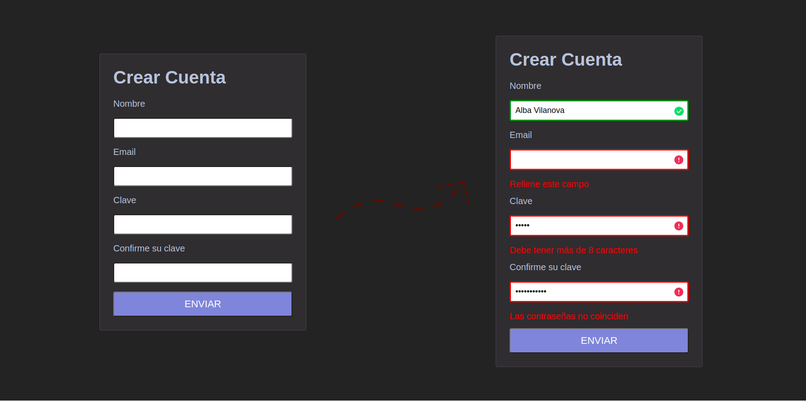

<h1 align="center"><b>Samsung Desarrolladoras 2022/23</b></h1>
<h2>Front-end exercise</h2>

This code is a solution to the final exercise of the second phase of the program Samsung Desarrolladoras 2022/23, with the aim to create a registration form with fields validation.

 
  

<h2>Full-stack exercise</h2>

Here we can see the result from the final exercise of the third phase of the program, where a registration form can store the received data to a database.

https://github.com/albavilanova/samsung-desarrolladoras/assets/56304139/ec7ce5d4-4f29-4dfd-9d94-f2bccd1ba75b
